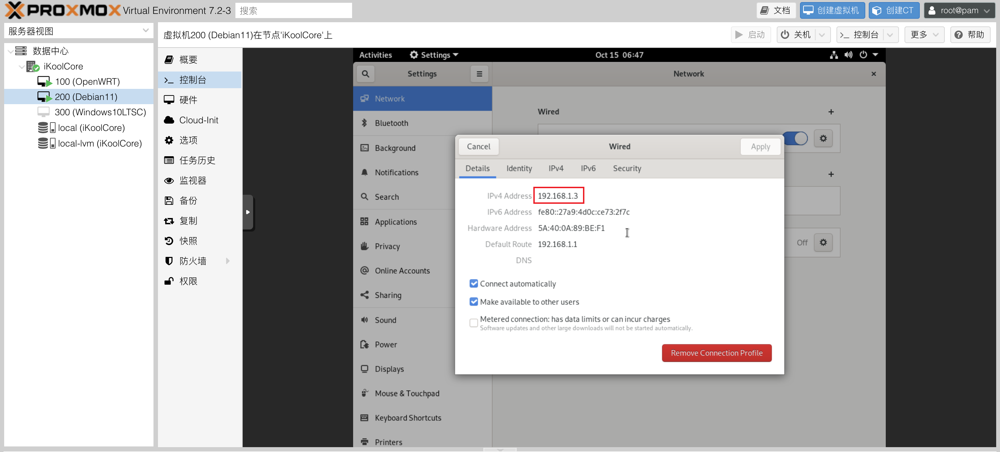

> 以下所有配置信息，`仅限购买带硬盘配置`的订单。 未选购带硬盘配置的小伙伴，需自行购买硬盘并安装需要的系统才能正常使用R1。

##### 默认安装的系统信息:

> 为了最大化利用R1为自己的工作和生活带来便利性，所有带硬盘配置机器默认安装PVE底层虚拟机。并在PVE基础之上安装了各种大家可能需要的虚拟机系统。

- 宿主机登陆信息：

  - 登陆网址：https://192.168.1.2:8006 （一定是https，一定需要带上端口号8006）
  - 登陆用户：root
  - 登陆密码：ikoolcore (全部小写)

- 虚拟机登陆信息：

  - 路由系统：

    > 默认分配1GB内存

    | 实例ID |  系统   | 后台登陆地址 | 登陆信息                                    | 备注                                                         |
    | :----: | :-----: | ------------ | ------------------------------------------- | ------------------------------------------------------------ |
    |  100   | OpenWRT | 192.168.1.1  | 用户名：`root` 密码：`ikoolcore`（小写） | `默认自动开启`，DHCP模式，为主路由。 LAN口：LAN1、LAN3、LAN4 WAN口：LAN2 `(eth1)` |

    > 需要使用其他路由系统作为主路由的话，请自行处理该OpenWRT虚拟机。

  - Linux系统（Debian11）：
    <small>**内存为8GB的机器，切记勿同时开启本Debian和102的Windows10，内存不够，容易导致宿主机死机。请二选一开机。**</small>
  
    
  
    > 默认分配4GB内存
    
    | 实例ID | 系统版本 | IP地址（固定） | 登陆信息                                                     |     备注     |
    | ------ | :------: | :------------: | :----------------------------------------------------------- | :----------: |
    | 101    | Debain11 |  192.168.1.3   | 方式1: PVE后台图形化界面登陆 方式2: ssh登陆 ssh ikoolcore@192.168.1.3 - 用户名：ikoolcore - 密码：ikoolcore | 默认自动开启 |
  
    > **<small>该Debain系统作为Docker的部署机器，以下所有docker服务均部署在该Debian虚拟机上。</small>**
    
    |    Docker     |               应用场景               | 镜像地址 |                           登陆信息                           | 备注 |
    | :-----------: | :----------------------------------: | :------: | :----------------------------------------------------------: | :--: |
    |   Portainer   |         Docker图形化管理工具         |          | 后台: https://192.168.1.3:9443 用户名：admin 密码：`ikoolcoreikoolcore` |      |
    |     Alist     |           网盘在线分享工具           |          | 后台: http://192.168.1.3:5244 用户名：admin 密码：`ikoolcore` |      |
    |  LibreSpeed   |            内外网测速工具            |          |                 地址：http://192.168.1.3:86                  |      |
    | OpenSpeedTest |            内外网测速工具            |          |                地址：https://192.168.1.3:3000                |      |
    |    Squoosh    | GoogleChrome团队开源 图片压缩工具 |          |                地址：https://192.168.1.3:7701                |      |
    |   TrwebOCR    |             OCR识别工具              |          |                地址：https://192.168.1.3:8089                |      |
    |  PhotoPrism   |             相册管理管理             |          | 后台: https://192.168.1.3:2342 用户名：iKoolCore 密码：`ikoolcore` |      |
    
  - Windows系统（Windows 10 LTSC 2021，默认分配4GB内存）——默认关闭。
    <small>**内存为8GB的机器，切记勿同时开启本Windows10和Debian，内存不足，会导致宿主机直接死机。请二选一开机。**</small>
    
    | 实例ID |       系统版本       | IP地址（固定） | 登陆信息                                      |   备注   |
    | :----: | :------------------: | :------------: | --------------------------------------------- | :------: |
    |  103   | Windows 10 LTSC 2021 |  192.168.1.4   | 用户名：iKoolCore 密码：ikoolcore (全小写) | `跳板机` |
    
    <small>**远程桌面已打开，远程桌面默认端口号：3389 内网使用另外一台PC连接此Windows10虚拟机的方法： 1. Windows系统：使用系统自带的远程桌面进行连接； 2. Mac系统：下载Microsoft Remote Desktop（国内不好下载，可通过此[iKoolCore网盘](https://u.iswott.com:8888/)进行下载）**</small>
    
    > <small>**此Windows10虚拟机可以作为下载机24小时开机，可以在R1上通过USB挂载存储设备，USB存储设备直通给此Windows虚拟机，挂PT下载，也可以直接使用阿里云盘、百度云盘、迅雷云盘等网盘工具，直接下载在线云盘内的资料文件到本地虚拟机或USB存储设备上。**</small>

