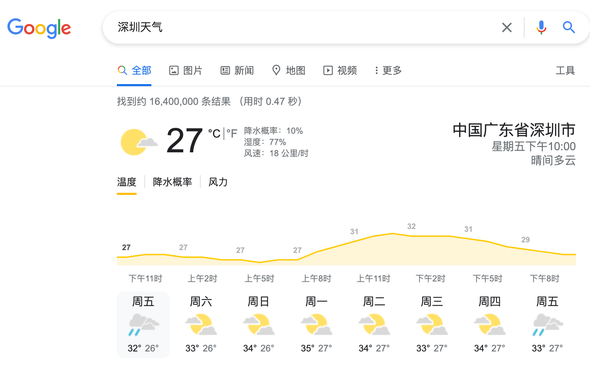
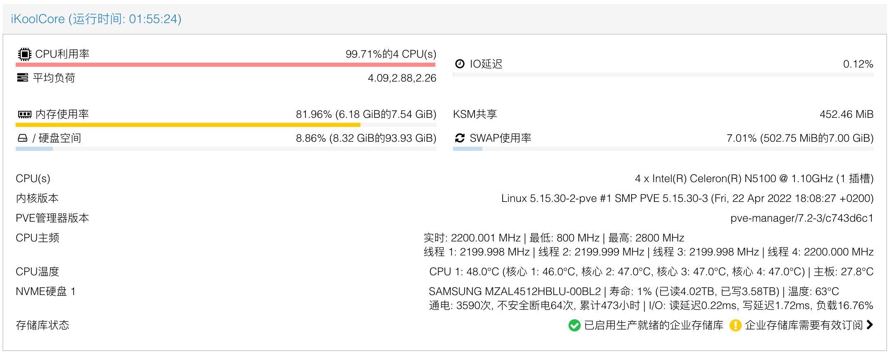

##### 硬件参数：

> 从0到1，全新设计。

- - CPU：赛扬N5105、奔腾N6005
  - 内存：板载海力士/三星 LPDDR4 双颗粒，双通道

  - 网卡：Intel i226-v    **<small>(优于i225-v)</small>**

  - 硬盘：M.2 **<small>接口形式（单双缺口都行）</small>** 2242 **<small>硬盘尺寸规格</small>** ， 支持 `SATA(NGFF)` 和 `NVMe(x2速率)`协议 **<small>(二选一，主板不同)</small>**

  - 显示输出：HDMI 2.0 4K60Hz视频输出

  - USB接口：USB 3.1 Gen1 x 2; USB-C 3.1 Gen1 x 1; TF Card x 1  **<small>(支持启动)</small>**

  - 散热方式：主动散热

  - 供电方式：USB-C接口供电 12V2A或12V3A  **<small>(标配PD诱骗线，可使用PD充电头配合诱骗线供电)</small>**

  - 产品尺寸：**7.5 x 7.5 x 4.8 cm  <small>（方寸之间 尽享乐趣）</small>**

##### 产品外壳：

全金属铝合金外壳，阳极氧化工艺打造

##### 关于产品的Q&A：

> 集中回答在各位关注硬酷R1的小伙伴可能会问到的几个硬件设计问题。

1. 产品供电为什么不使用PD协议，但却用C口供电？两个C口，如果用户插错了接口，会导致烧坏主板吗？ 
   **<small>答：主板空间，寸土寸金。为了更好的节省空间，故舍弃传统的体积较大的DC供电接口，改为C口，由于产品立项初期，PD芯片市场售价较贵，成本考虑，未选择支持PD协议。但是产品包装标配20cm的定制PD诱骗线，如果您是使用PD充电头供电，可以通过我们提供的诱骗线转接即可正常使用。如果用户将C口供电线插入USB-C接口，机器不会启动，主板不会有任何影响，如果你发现你的产品插电后无法启动，请检查是否将电源C口插到了正确的DC供电口。</small>**

2. 产品主动散热风扇支持自动温控调速吗？噪音大不大？ 
   **<small>答：由于产品极致的三维尺寸，硬酷R1采用主动散热风扇设计，风扇为独家定制开模产品（后续会单独上架SKU，可单独零售），所有风扇开机就会启动，不可调速。机器整体噪音不大，实测30cm之外，人耳分辨不出噪音（环境噪音更大）有震动就会有产生声音，所以主动散热风扇有噪音是不可避免的。</small>**

3. 产品扩展性如何？ 
   **<small>答：产品设计之初，定位非常清晰。仅硬盘为用户可自行升级的硬件。硬盘采用M.2接口，2242尺寸的SATA或NVMe协议硬盘，二选一，选择后不可使用另外一种协议的硬盘。</small>**

4. R1的功耗多少？

   **<small>答：抛开负载谈功耗是耍流氓！物理机下跑OpenWRT和虚拟机下跑OpenWRT的负载肯定是不一样的，那么功耗肯定也不一样。日常物理机下跑个OpenWRT的功耗低于8w（不外接USB设备的情况下）；CPU在100%负载情况下，肯定超过15w，但不会超过20w；跟你们科普下初中物理电相关的能耗知识。 1.1000w的设备用1个小时，消耗市电1度；假设R1的功耗为10w，那么得100个小时（4天+）才能消耗1度市电，一个月需要7-8度点； 2. 假设R1极端情况下（外接两个USB 2.5寸盘，24小时不间断跑PT下载...）的功耗为25w，那么需要40个小时消耗1个单位市电，一个月约需要18度市电能耗; 3. 两种情况下的电能耗分别为8和18，中间10度电够你们买杯瑞幸咖啡吗？ ——一个月少喝杯瑞幸咖啡而已，很在乎？ 😊总之：骚年们，别被垃圾佬、UP主们搞的数字焦虑，有点自己的独立思考能力，谢谢！ 🤡后续关于功耗的问题，一律不解答。没实际的现实意义。</small>**

5. 侧面Type-C口是否可以支持视频传输？

   **<small>答：不行，侧面C口为USB 3协议，非雷电，非USB 4.0，就是个普通的传数据的C口（电源误插到该口，不会烧坏主板）。</small>**

6. R1机器散热如何？

   **<small>答：主动散热设计。单纯不讲负载，不说环境温度，聊发热/散热也是耍流氓。日常纯物理OpenWRT下，主动散热加持下，大部分地区（地区不同，环境气温不同）不会超过50度。作为体积极致小巧的机器，在产品品质层面，我们能做到的是高负载带来高发热的情况下，即使CPU温度超过70降频了，也不会死机，这个是产品质量底线。至于你要问具体的温度表现，我真没有办法控制变量给你一个满意的真实的回复，抱歉。下图为9月23日的深圳测试所得，CPU 87%负载， 内存79%的负载下，晚上天气温度27度下的温度表现（注意测试样品CPU为N5100，TDP 6W， 相同条件下N5105预计温度会高2-5度。）</small>**
   
   
   
   **运行20分钟后，晚上22:53分**
   
   

